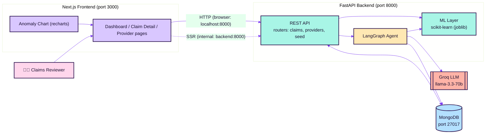
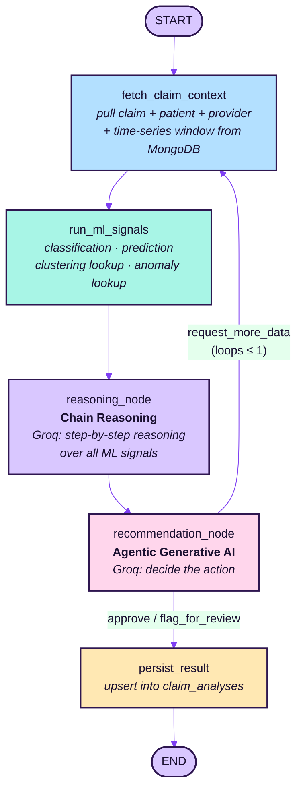
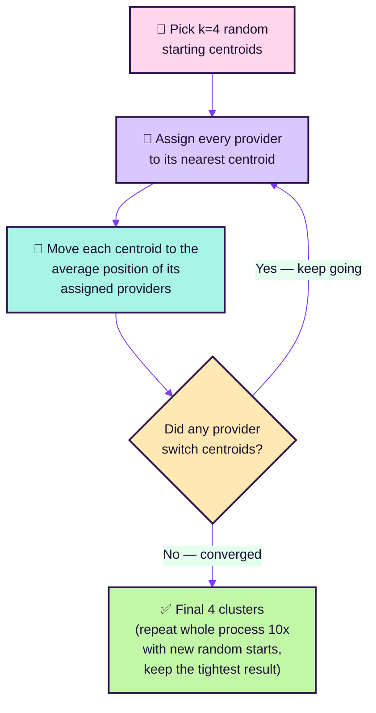

<div align="center">

# 🩺 AI Claims Review Assistant

### Cotiviti Intern Assessment · Topic 2 — Clinical Decision Making & Pattern Recognition in Health Care


</div>

A hackathon proof-of-concept demonstrating six AI capabilities working together over
synthetic healthcare claims — applied to **T**reatment, **P**ayment, and **O**perations
(TPO) claims review:

<div align="center">


</div>

> [!TIP]
> **New here?** Jump to [Domain Primer](#1--domain-primer--what-is-actually-being-modeled)
> if healthcare billing terms (claim, provider, payer) are unfamiliar, or straight to
> [The Big Idea](#2--the-big-idea) if you just want the gist.

### 📚 Table of Contents

| | | |
|---|---|---|
| [1. 🏥 Domain Primer](#1--domain-primer--what-is-actually-being-modeled) | [5. 🔑 The Six Buzzwords](#5--the-six-buzzwords-explained-plainly-and-exactly-where-they-run) | [9. 🔌 API Endpoints](#9--api-endpoints) |
| [2. 💡 The Big Idea](#2--the-big-idea) | [6. 🎯 KMeans Deep Dive](#6--kmeans-deep-dive--how-clustering-actually-works) | [10. 🚀 Run & Test](#10--run--test) |
| [3. 🏗️ Project Architecture](#3--project-architecture) | [7. 🧬 Data & ML Layer](#7--data--ml-layer) | [11. 🗺️ Capability → Code Map](#11--capability--code-map-quick-reference) |
| [4. 🕸️ LangGraph Agent](#4--langgraph-agent-architecture) | [8. 📁 Directory Structure](#8--directory-structure) | |

---

## 1. 🏥 Domain Primer — What Is Actually Being Modeled

If you've never worked in healthcare billing, start here.

- **Provider** — the hospital, clinic, or doctor that delivers treatment.
- **Patient** — the person treated.
- **Claim** — the bill a provider sends to an insurance company after treating a
  patient. It says: "we did procedure X for diagnosis Y, it cost $Z, please pay us."
- **Payer** — the insurance company that receives the claim and decides how much of it
  to actually pay. **Cotiviti's real business is being hired by payers to review claims
  before/after payment** — catching overcharges, coding errors, or fraud. This POC
  simulates that reviewer role with AI.
- **Billed amount vs. Paid amount** — the billed amount is what the provider *asked
  for*; the paid amount is what the payer *actually pays* (after contract rates,
  negotiations, or denials). A claim that's fully denied has `paid_amount = 0`.
- **TPO (Treatment, Payment, Operations)** — the three angles claims get reviewed from:
  was the *treatment* medically appropriate, is the *payment* amount correct, and does
  the provider's *operational* billing pattern (volume, frequency, timing) look normal.

**The money flow:**
```
Patient treated → Provider submits a CLAIM → Payer (insurer) reviews it → Payer pays the provider
                                                        ↑
                                          This is the step this POC's AI assists with.
```

---

## 2. 💡 The Big Idea

A claims reviewer opens a claim and clicks **Run AI Analysis**. Under the hood:

1. Two ML models score **that specific claim** live (risk classification, payment
   prediction).
2. Two other ML models contribute **pre-computed context** about the claim's provider
   (which behavioral cluster it belongs to, whether its recent billing looks anomalous).
3. A **LangGraph** agent reads all four signals, writes out step-by-step reasoning
   (chain reasoning), and — via a real call to **Groq**'s LLM — decides a final action:
   `approve`, `flag_for_review`, or `request_more_data`. If it's unsure, it can loop
   back and re-fetch a wider data window before deciding again (this loop is what makes
   it *agentic*, not just a single prompt-response).
4. The full result is saved to MongoDB and rendered on a Cotiviti-branded Next.js
   dashboard. Claims can also be **bulk-uploaded via CSV** (one or many at once).

### 🎬 The human flow, visually

```mermaid
%%{init: {"theme": "base", "themeVariables": {"primaryColor": "#ede4ff", "primaryBorderColor": "#2e1650", "primaryTextColor": "#1a1030", "lineColor": "#7e3ff2", "fontSize": "15px"}}}%%
flowchart LR
    A(["🧑‍⚕️<br/>Reviewer opens<br/>the dashboard"]) --> B["📋<br/>Picks a claim<br/>(or uploads a CSV)"]
    B --> C["🧮<br/>Backend runs 4 ML signals<br/>classification · prediction<br/>clustering · anomaly lookup"]
    C --> D["🧠<br/>LangGraph agent reasons<br/>step-by-step via Groq"]
    D --> E{"🤖<br/>Agent decides"}
    E -->|"needs more data"| C
    E -->|"approve / flag"| F["💾<br/>Saved to MongoDB"]
    F --> G["📊<br/>Dashboard shows signals,<br/>reasoning & recommendation"]

    style A fill:#ffd6ec,stroke:#2e1650,stroke-width:2px,color:#1a1030
    style B fill:#ffe8b3,stroke:#2e1650,stroke-width:2px,color:#1a1030
    style C fill:#d9c7ff,stroke:#2e1650,stroke-width:2px,color:#1a1030
    style D fill:#c3aaff,stroke:#2e1650,stroke-width:2px,color:#1a1030
    style E fill:#ffd6ec,stroke:#2e1650,stroke-width:2px,color:#1a1030
    style F fill:#a8f5e6,stroke:#2e1650,stroke-width:2px,color:#1a1030
    style G fill:#ffe8b3,stroke:#2e1650,stroke-width:2px,color:#1a1030
```



---

## 3. 🏗️ Project Architecture



> [!NOTE]
> **Why two arrows from the frontend to the API?** Browser-side calls (e.g. the Analyze
> button) use the host URL `http://localhost:8000`; Next.js server-side rendering inside
> Docker uses the internal service name `http://backend:8000`. See `frontend/lib/api.ts`.

---

## 4. 🕸️ LangGraph Agent Architecture

The agent is a `StateGraph` (`backend/agent/graph.py`) with a shared typed `AgentState`
(`backend/agent/state.py`). Nodes run in sequence; the recommendation node can loop back
**once** to fetch a wider data window before deciding — this is the *agentic* behavior.



| Node | File / function | Responsibility | Capability |
|------|------|----------------|-----------|
| `fetch_claim_context` | `agent/graph.py:39` | Load claim/patient/provider + a 30-day (or 90-day on retry) timeseries window from Mongo | — |
| `run_ml_signals` | `agent/graph.py:65` | Call the 4 scikit-learn signal sources |     |
| `reasoning_node` | `agent/graph.py:91` | Groq produces 4-6 numbered chain-of-thought steps over the signals |  |
| `recommendation_node` | `agent/graph.py:113` | Groq decides the action; can request more data (bounded by `MAX_LOOPS = 1`) |  |
| `persist_result` | `agent/graph.py:153` | Upsert the `AnalysisResult` into `claim_analyses` | — |

The graph itself is wired in `build_graph()` (`agent/graph.py:174`), and
`_route_after_recommendation()` (`agent/graph.py:168`) is the conditional edge that
implements the loop-back.

---

## 5. 🔑 The Six Buzzwords, Explained Plainly (and Exactly Where They Run)

<table>
<thead>
<tr><th>Technique</th><th>Plain-language meaning</th><th>What it does here</th><th>When it runs</th></tr>
</thead>
<tbody>

<tr>
<td></td>
<td>Sort something into a labeled bucket</td>
<td>Looks at <i>this claim's</i> amount, procedure, treatment type, patient age, etc. and predicts a risk bucket: <code>Low</code> / <code>Medium</code> / <code>High</code></td>
<td><br/><code>ml/inference.py::classify_claim()</code></td>
</tr>

<tr>
<td></td>
<td>Estimate a number you don't know yet</td>
<td>Predicts what <i>this claim</i> should reasonably be paid, so it can be compared against what was actually paid</td>
<td><br/><code>ml/inference.py::predict_payment()</code></td>
</tr>

<tr>
<td></td>
<td>Group similar things together <i>without</i> being told the groups in advance</td>
<td>Groups all 30 providers by billing behavior into 4 discovered clusters, then names them by rank (e.g. "Low-Cost Routine Care") — see <a href="#6--kmeans-deep-dive--how-clustering-actually-works">§6 KMeans Deep Dive</a></td>
<td><br/><code>train_models.py::train_clustering()</code></td>
</tr>

<tr>
<td></td>
<td>Notice when a value looks statistically weird vs. its own recent history</td>
<td>Rolls a 7-day window over daily claim counts/paid totals per provider, z-scores them, flags outlier days</td>
<td><br/><code>train_models.py::train_anomaly_detector()</code></td>
</tr>

<tr>
<td></td>
<td>Think step-by-step out loud instead of jumping straight to an answer</td>
<td>The LLM produces 4-6 numbered reasoning steps over the 4 signals before any decision is made</td>
<td><br/><code>reasoning_node</code> (Groq call)</td>
</tr>

<tr>
<td></td>
<td>An AI that can take an action (like fetching more data) instead of just answering once</td>
<td>Decides <code>approve</code> / <code>flag_for_review</code> / <code>request_more_data</code>; can loop back for more context (bounded)</td>
<td><br/><code>recommendation_node</code> (Groq call + loop)</td>
</tr>

<tr>
<td></td>
<td>Combining multiple clues into one overall conclusion</td>
<td>The final synthesis step where all 4 signals + reasoning get folded into one <code>AnalysisResult</code></td>
<td><br/>across <code>agent/graph.py</code></td>
</tr>

</tbody>
</table>

> [!IMPORTANT]
> **Why split live vs. pre-computed?** It mirrors how a real production system would be
> built: you don't want to re-cluster every provider or re-scan a whole time series every
> time someone opens one claim — that's exactly the kind of thing you'd run as a scheduled
> batch job (e.g. nightly). Only the claim-specific work (classify *this* claim, predict
> *this* payment, reason about *this* claim) makes sense to compute on demand.

---

## 6. 🎯 KMeans Deep Dive — How Clustering Actually Works

KMeans is the algorithm behind the provider clustering signal, and it's worth
understanding properly since it's genuinely different from the other techniques here
(it's an **unsupervised algorithm**, not a trained prediction model — see the callout
below).

### The mental model: rows become points, columns become dimensions

Each **provider** (a row of data) is reduced to a handful of numbers — its **features**:

```
avg_billed, claim_volume, denial_rate, avg_length_of_stay
```

Each of those 4 numbers is one **dimension**. So provider `PRV0001` (Doyle Ltd Clinic)
becomes a point floating in 4-dimensional space: `[8002, 57, 0.14, 3.2]`. With 2
features you could literally plot this on graph paper (x-axis, y-axis, a dot). With 4,
it's the same idea — just a scatter plot with more axes than you can draw, but the
distance math works identically. **KMeans never sees the provider's name, specialty, or
region — only whichever numeric columns you feed it.**

### The algorithm, step by step



1. **Pick centroids** — `k` (here, 4) random points are dropped into the same 4-D space
   as the providers. A centroid is just a candidate "cluster center" — it's a point with
   its own 4 numbers, **not** an axis. It starts as a pure guess.
2. **Assign** — every provider gets grouped with whichever centroid it's numerically
   closest to (straight-line distance across all 4 dimensions).
3. **Move** — now that a centroid has real providers assigned to it, compute the
   *average* of their 4 numbers, and relocate the centroid there. A guessed center gets
   replaced by an evidence-based one.
4. **Repeat** — because centroids moved, some providers may now be closer to a
   *different* centroid, so re-assign and re-average again. This continues until nothing
   changes: the average of each group's points *is* the centroid's position — that's
   convergence, not necessarily the single best possible grouping (which is why...)
5. **`n_init=10`** — the whole process (steps 1-4) runs **10 times** with different
   random starting centroids, and scikit-learn keeps whichever run produced the tightest
   clusters. This guards against a bad, unlucky first guess.

### Where this lives in the code

```python
# backend/ml/train_models.py:95-121  (train_clustering)
feature_cols = ["avg_billed", "claim_volume", "denial_rate", "avg_length_of_stay"]
scaler = StandardScaler()                    # put all 4 axes on comparable scale
X_scaled = scaler.fit_transform(agg[feature_cols])

kmeans = KMeans(n_clusters=4, random_state=42, n_init=10)
agg["cluster_id"] = kmeans.fit_predict(X_scaled)   # the entire algorithm above, in 1 line
```

> [!NOTE]
> **Why `StandardScaler` first?** `avg_billed` lives in the thousands while
> `denial_rate` lives between 0 and 1. Without rescaling, distance would be almost
> entirely driven by `avg_billed` just because its raw numbers are bigger, and the other
> 3 dimensions would barely matter.

> [!TIP]
> **Algorithm vs. prediction model — not the same thing.** The classifier/predictor are
> *supervised*: trained on labeled examples (`risk_label`, `paid_amount` already known),
> so they can predict a value for a **brand-new** claim they've never seen. KMeans is
> *unsupervised*: there's no "correct cluster" anywhere in the data — it just discovers
> structure in the 30 providers you feed it, once. A new provider doesn't get an
> automatic cluster; you'd need to re-run clustering over the whole provider set again.

### Why KMeans specifically (vs. other clustering algorithms)

KMeans is simple, fast, and easy to explain to non-technical stakeholders — which
matters when the output ("Low-Cost Routine Care") needs to be justifiable to a claims
reviewer. Its main tradeoffs: you must pick `k` in advance (hardcoded to `4` here), and
it assumes roughly round, similar-sized clusters. Alternatives like DBSCAN (no need to
pick `k`, handles odd shapes) or Hierarchical Clustering (gives every possible `k` at
once) are more flexible but slower and harder to explain — a reasonable tradeoff to
flag in your report, but the right call for a fast, explainable hackathon POC.

### What "Low-Cost, High-Volume" (etc.) means

After clustering, `train_models.py` **ranks the 4 discovered clusters by average billed
amount** and assigns human-readable cost-tier labels (`COST_TIER_LABELS` at
`train_models.py:33`), then **independently** overwrites whichever single cluster has
the highest denial rate with a dedicated outlier label (`OUTLIER_LABEL`):

<table>
<tbody>
<tr><td></td><td>Cheapest cluster by avg. billed amount — small dollar amounts per claim, but many claims — e.g. a general clinic doing frequent routine visits</td></tr>
<tr><td></td><td>2nd-cheapest cluster — mid-range billing and volume, the "typical" provider</td></tr>
<tr><td></td><td>3rd-cheapest cluster — larger dollar amounts per claim, fewer claims</td></tr>
<tr><td></td><td>Priciest cluster by avg. billed amount — e.g. a specialty/surgical center — <b>unless</b> it's also the highest-denial cluster, in which case the row below takes over</td></tr>
<tr><td></td><td>Whichever single cluster has the highest denial rate, <b>regardless of its cost rank</b> — always earned by denial rate alone, never by being the priciest cluster</td></tr>
</tbody>
</table>

> [!NOTE]
> **Why 5 labels for 4 clusters?** Cost rank and denial rate are two independent
> rankings that can point at different clusters. Earlier, the priciest cluster's
> cost-tier label and the outlier label were the *same* string
> (`"High-Risk / High-Denial Outlier"` doubled as both), so if the actual
> highest-denial cluster wasn't also the priciest one, two different clusters ended up
> sharing the outlier badge while `"Standard Volume Care"` went completely unused.
> Giving the priciest tier its own dedicated `"Premium / High-Cost Care"` label fixes
> that: exactly one cluster ever carries the outlier badge, and it's always earned by
> denial rate, never by cost coincidence. One cost-tier label goes unused whenever the
> outlier cluster isn't the priciest one — that's expected, not a bug.

This matters for review because the *same* dollar jump means different things in
different clusters — a big spike is more suspicious for a normally low-cost, high-volume
clinic than for a provider that already bills large amounts routinely.

---

## 7. 🧬 Data & ML Layer

**Synthetic data** (`backend/data_gen/generate_data.py`, fixed seed — no real patient
data is used anywhere):

| Collection | ~Count | Key fields |
|-----------|--------|-----------|
| `providers` | 30 | specialty, region, avg_claim_amount, + `cluster_id`/`cluster_label` |
| `patients` | 200+ | age, gender, chronic_conditions (grows as claims are uploaded) |
| `claims` | 1,500+ | billed/paid amount, treatment_type, length_of_stay, `risk_label` (grows via CSV upload) |
| `provider_timeseries` | 5,400 | daily_claim_count, daily_paid_total, + `anomaly_score`/`is_anomaly` |

**Models** (`backend/ml/train_models.py`, persisted with joblib, loaded once at startup
in `ml/inference.py`):

<table>
<thead><tr><th>Model</th><th>Algorithm</th><th>Trained on</th><th>Capability</th></tr></thead>
<tbody>
<tr><td><code>classifier.joblib</code></td><td>RandomForestClassifier (200 trees, depth 8)</td><td>billed_amount, length_of_stay, prior_claims_count, age, treatment_type, procedure_code → <code>risk_label</code></td><td></td></tr>
<tr><td><code>predictor.joblib</code></td><td>GradientBoostingRegressor (150 estimators, depth 3)</td><td>billed_amount, length_of_stay, provider_avg_claim_amount, treatment_type → <code>paid_amount</code></td><td></td></tr>
<tr><td><code>cluster_model.joblib</code></td><td>KMeans (k=4) on standardized features</td><td>avg_billed, claim_volume, denial_rate, avg_length_of_stay (per provider) → cluster</td><td></td></tr>
<tr><td><code>anomaly_model.joblib</code></td><td>IsolationForest (contamination=0.05)</td><td>rolling 7-day z-scores of daily claim count &amp; paid total → anomaly flag</td><td></td></tr>
</tbody>
</table>

Training runs once (`python -m ml.train_models`, or automatically inside the backend
Docker image build) and writes the cluster/anomaly results back onto
`providers.csv`/`provider_timeseries.csv` so they seed into MongoDB pre-computed.

> [!WARNING]
> All claims/patients/providers are **synthetic** (generated with a fixed random seed) —
> no real PHI (Protected Health Information) is used anywhere in this project.

---

## 8. 📁 Directory Structure

<details>
<summary><b>Click to expand the full folder tree</b></summary>

```
Cotiviti-Intern-Topic2/
├── docker-compose.yml            # mongo + backend + frontend
├── README.md                     # this file
├── .env.example                  # env var template (real .env files are gitignored)
├── sample_claims_upload.csv      # example file for the bulk-upload feature
│
├── backend/                      # FastAPI + ML + LangGraph
│   ├── Dockerfile / entrypoint.sh
│   ├── main.py                   # app + CORS + routers
│   ├── core/config.py            # settings (.env)
│   ├── db/mongo.py               # motor async client
│   ├── models/schemas.py         # Pydantic models
│   ├── data_gen/                 # generate_data.py, seed_mongo.py
│   ├── ml/                       # train_models.py, inference.py, models/*.joblib
│   ├── agent/                    # graph.py (LangGraph), state.py
│   ├── routers/                  # claims.py (incl. CSV upload), providers.py, seed.py
│   └── tests/                    # test_data_gen.py, test_ml.py, test_api_smoke.py
│
└── frontend/                     # Next.js (App Router, TS, Tailwind v4)
    ├── Dockerfile
    ├── app/                      # page.tsx, claims/[id], providers/, providers/[id]
    ├── components/                # SiteHeader, CotivitiLogo, ClaimTable, SignalsPanel,
    │                              # ReasoningNarrative, AnomalyChart, ProviderSparkline,
    │                              # RiskBadge, AppMockup, UploadClaimsButton/Modal, ...
    └── lib/                      # api.ts (fetch wrapper), types.ts
```

</details>

---

## 9. 🔌 API Endpoints

| Method | Path | Purpose |
|--------|------|---------|
| `GET` | `/health` | Liveness check |
| `POST` | `/seed` | Reseed MongoDB from CSVs |
| `GET` | `/claims` | List claims |
| `GET` | `/claims/{id}` | Single claim |
| `POST` | `/claims/upload` | **Bulk-upload one or many claims via CSV** (per-row validation, optional `auto_analyze`) |
| `POST` | `/claims/{id}/analyze` | **Run the LangGraph agent** |
| `GET` | `/claims/{id}/analysis` | Fetch stored analysis |
| `GET` | `/providers` | List providers (with cluster) |
| `GET` | `/providers/{id}/cluster` | Provider cluster detail |
| `GET` | `/providers/{id}/timeseries` | Daily billing series + anomaly flags |

---

## 10. 🚀 Run & Test

### Run with Docker (recommended — one command)

The entire app is dockerized: **MongoDB + FastAPI + Next.js**. The backend image bakes
in the synthetic data and trained ML models and seeds MongoDB automatically on startup.

```bash
docker compose up --build -d
#   App  → http://localhost:3000
#   Docs → http://localhost:8000/docs
#   MongoDB → localhost:27017
```

> [!IMPORTANT]
> For the **Run AI Analysis** button to work, put a real `GROQ_API_KEY` (free at
> [console.groq.com](https://console.groq.com)) in a `.env` file at the repo root
> (next to `docker-compose.yml`) — copy `.env.example` and fill it in. Changing `.env`
> requires **recreating** the container (`docker compose up -d backend`), not just
> `docker compose restart` — restart doesn't re-read `.env` for variable substitution.

<details>
<summary><b>Run locally without Docker</b></summary>

```bash
# 1. MongoDB only
docker compose up -d mongo

# 2. Backend
cd backend
python -m venv venv && venv\Scripts\activate     # Windows
pip install -r requirements.txt
copy ..\.env.example .env                        # then set GROQ_API_KEY

python -m data_gen.generate_data   # generate synthetic providers/patients/claims/timeseries
python -m ml.train_models          # train classifier, predictor, cluster & anomaly models
python -m data_gen.seed_mongo      # load everything into MongoDB
uvicorn main:app --reload --port 8000

# 3. Frontend (separate terminal)
cd frontend
npm install
copy .env.local.example .env.local
npm run dev
```

</details>

### Tests

```bash
cd backend
pytest tests/test_data_gen.py tests/test_ml.py    # unit (no services needed)

docker compose up --build -d                      # then, full suite incl. live API:
API_BASE_URL=http://localhost:8000 pytest
```

- `tests/test_data_gen.py` — synthetic data shape, referential integrity, risk labels
- `tests/test_ml.py` — classification/prediction outputs, all 4 models load correctly
- `tests/test_api_smoke.py` — live API: health, claims, provider cluster/timeseries,
  analyze, **CSV upload** (valid + invalid rows, missing columns)

### Try it end-to-end

- Dashboard (`/`) → click a claim → **Run AI Analysis** → see all 4 ML signals +
  the agent's chain-of-thought reasoning + recommendation
- **Upload Claims** button on the dashboard → drag in `sample_claims_upload.csv` (or
  download the in-app template) → optionally auto-analyze every uploaded claim
- `/providers` → every provider's billing time series + average billed amount at a
  glance → click into one for the full anomaly chart

---

## 11. 🗺️ Capability → Code Map (quick reference)

<table>
<tbody>
<tr><td></td><td><code>backend/agent/graph.py::reasoning_node</code></td></tr>
<tr><td></td><td><code>backend/agent/graph.py::recommendation_node</code> (+ conditional loop)</td></tr>
<tr><td></td><td><code>ml/train_models.py::train_classifier</code> (RandomForest) + <code>ml/inference.py::classify_claim</code></td></tr>
<tr><td></td><td><code>ml/train_models.py::train_predictor</code> (GradientBoosting) + <code>ml/inference.py::predict_payment</code></td></tr>
<tr><td></td><td>Signal synthesis into <code>AnalysisResult</code> across <code>agent/graph.py</code></td></tr>
<tr><td></td><td><code>ml/train_models.py::train_clustering</code> (KMeans) → <code>frontend/app/providers/</code></td></tr>
<tr><td></td><td><code>ml/train_models.py::train_anomaly_detector</code> (IsolationForest) → <code>components/AnomalyChart.tsx</code></td></tr>
</tbody>
</table>

---

<div align="center">

*This is a hackathon POC, not production software — no auth, no deployment config,
models are trained offline via a one-time script rather than a full MLOps pipeline.*

</div>
