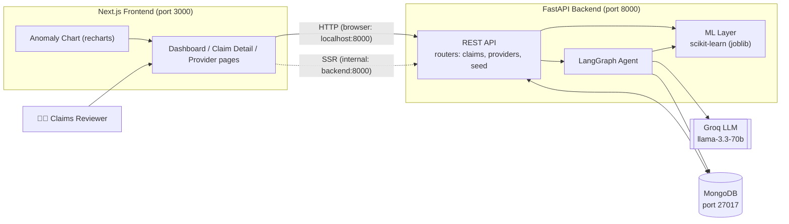
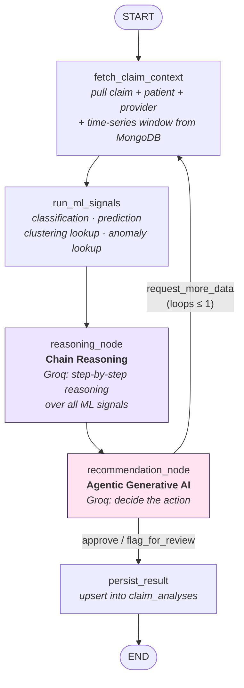

# Project Guide — AI Claims Review Assistant

A hands-on guide to the codebase for **Cotiviti Intern Assessment, Topic 2:
Clinical Decision Making and Pattern Recognition in Health Care**.

This POC demonstrates six AI capabilities working together over synthetic healthcare
claims: **Classification, Prediction, Inference, Clustering, Time-Series Anomaly
Detection, Chain Reasoning, and Agentic Generative AI** — applied to Treatment, Payment,
and Operations (TPO).

---

## 1. Domain Primer — What Is Actually Being Modeled

If you've never worked in healthcare billing, start here.

- **Provider** — the hospital, clinic, or doctor that delivers treatment.
- **Patient** — the person treated.
- **Claim** — the bill a provider sends to an insurance company after treating a
  patient. It says: "we did procedure X for diagnosis Y, it cost $Z, please pay us."
- **Payer** — the insurance company that receives the claim and decides how much of it
  to actually pay. **Cotiviti's real business is being hired by payers to review claims
  before/after payment** — catching overcharges, coding errors, or fraud. This POC
  simulates that reviewer role with AI.
- **Billed amount vs. Paid amount** — the billed amount is what the provider *asked
  for*; the paid amount is what the payer *actually pays* (after contract rates,
  negotiations, or denials). A claim that's fully denied has `paid_amount = 0`.
- **TPO (Treatment, Payment, Operations)** — the three angles claims get reviewed from:
  was the *treatment* medically appropriate, is the *payment* amount correct, and does
  the provider's *operational* billing pattern (volume, frequency, timing) look normal.

**The money flow:**
```
Patient treated → Provider submits a CLAIM → Payer (insurer) reviews it → Payer pays the provider
                                                        ↑
                                          This is the step this POC's AI assists with.
```

---

## 2. The Big Idea

A claims reviewer opens a claim and clicks **Run AI Analysis**. Under the hood:

1. Two ML models score **that specific claim** live (risk classification, payment
   prediction).
2. Two other ML models contribute **pre-computed context** about the claim's provider
   (which behavioral cluster it belongs to, whether its recent billing looks anomalous).
3. A **LangGraph** agent reads all four signals, writes out step-by-step reasoning
   (chain reasoning), and — via a real call to **Groq**'s LLM — decides a final action:
   `approve`, `flag_for_review`, or `request_more_data`. If it's unsure, it can loop
   back and re-fetch a wider data window before deciding again (this loop is what makes
   it *agentic*, not just a single prompt-response).
4. The full result is saved to MongoDB and rendered on a Cotiviti-branded Next.js
   dashboard.

```
Reviewer → Next.js → FastAPI → [ ML models + LangGraph agent (Groq) ] → MongoDB → Dashboard
```

> 🎨 For a friendly, hand-drawn version of this flow, open **`project_flow.excalidraw`**
> at [excalidraw.com](https://excalidraw.com) (*Menu → Open*) or with the VS Code
> "Excalidraw" extension.

---

## 3. Project Architecture



**Why two arrows from the frontend to the API?** Browser-side calls (the Analyze button)
use the host URL `http://localhost:8000`; Next.js server-side rendering inside Docker uses
the internal service name `http://backend:8000`. See `frontend/lib/api.ts`.

---

## 4. LangGraph Agent Architecture

The agent is a `StateGraph` (`backend/agent/graph.py`) with a shared typed `AgentState`
(`backend/agent/state.py`). Nodes run in sequence; the recommendation node can loop back
**once** to fetch a wider data window before deciding — this is the *agentic* behavior.



| Node | File / function | Responsibility | Capability |
|------|------|----------------|-----------|
| `fetch_claim_context` | `agent/graph.py:39` | Load claim/patient/provider + a 30-day (or 90-day on retry) timeseries window from Mongo | — |
| `run_ml_signals` | `agent/graph.py:65` | Call the 4 scikit-learn signal sources | Classification, Prediction, Clustering, Anomaly Detection |
| `reasoning_node` | `agent/graph.py:91` | Groq produces 4-6 numbered chain-of-thought steps over the signals | **Chain Reasoning**, Inference |
| `recommendation_node` | `agent/graph.py:113` | Groq decides the action; can request more data (bounded by `MAX_LOOPS = 1`) | **Agentic Generative AI** |
| `persist_result` | `agent/graph.py:153` | Upsert the `AnalysisResult` into `claim_analyses` | — |

The graph itself is wired in `build_graph()` (`agent/graph.py:174`), and
`_route_after_recommendation()` (`agent/graph.py:168`) is the conditional edge that
implements the loop-back.

---

## 5. The Six Buzzwords, Explained Plainly (and Exactly Where They Run)

| # | Technique | Plain-language meaning | What it does here | Runs live on click, or pre-computed? |
|---|-----------|------------------------|--------------------|----------------------------------------|
| 1 | **Classification** | Sort something into a labeled bucket | Looks at *this claim's* amount, procedure, treatment type, patient age, etc. and predicts a risk bucket: `Low` / `Medium` / `High` | ✅ **Live** — `ml/inference.py::classify_claim()`, called from `agent/graph.py:71` |
| 2 | **Prediction** | Estimate a number you don't know yet | Predicts what *this claim* should reasonably be paid, so it can be compared against what was actually paid | ✅ **Live** — `ml/inference.py::predict_payment()`, called from `agent/graph.py:72` |
| 3 | **Clustering** | Group similar things together *without* being told the groups in advance | Groups all 30 providers by billing behavior (avg. bill size, claim volume, denial rate, avg. length of stay) into 4 discovered clusters, then names them by rank (e.g. "Low-Cost Routine Care," "High-Cost Complex Care") | ⚠️ **Pre-computed** once for all providers during `ml/train_models.py::train_clustering()` (`train_models.py:95`); the click just reads the provider's stored `cluster_id`/`cluster_label` |
| 4 | **Time-Series Anomaly Detection** | Notice when a value looks statistically weird compared to its own recent history | For each provider, rolls a 7-day window over daily claim counts/paid totals, z-scores them, and flags outlier days | ⚠️ **Pre-computed** once for the whole timeseries during `ml/train_models.py::train_anomaly_detector()` (`train_models.py:124`); the click just reads flags for the recent window |
| 5 | **Chain Reasoning** | Think step-by-step out loud instead of jumping straight to an answer | The LLM is prompted to produce 4-6 numbered reasoning steps over the 4 signals before any decision is made | ✅ **Live** — real Groq call in `reasoning_node` (`agent/graph.py:91`) |
| 6 | **Agentic Generative AI** | An AI that can take an action (like fetching more data) instead of just answering once | The LLM decides `approve` / `flag_for_review` / `request_more_data`; if it picks the latter, the graph *loops back* to re-fetch a wider window before answering again (bounded to prevent infinite loops) | ✅ **Live** — real Groq call + conditional graph edge in `recommendation_node` (`agent/graph.py:113`) |
| — | **Inference** | Combining multiple clues into one overall conclusion | The final synthesis step where classification + prediction + cluster + anomaly signals + reasoning all get folded into one `AnalysisResult` | ✅ **Live** — synthesized across `agent/graph.py` (`run_ml_signals` → `persist_result`) |

**Why split live vs. pre-computed?** It mirrors how a real production system would be
built: you don't want to re-cluster every provider or re-scan a whole time series every
time someone opens one claim — that's exactly the kind of thing you'd run as a scheduled
batch job (e.g. nightly). Only the claim-specific work (classify *this* claim, predict
*this* payment, reason about *this* claim) makes sense to compute on demand.

### What "Low-Cost, High-Volume" (etc.) means

Clustering doesn't get told what the groups should be — it just finds providers whose
`avg_billed`, `claim_volume`, `denial_rate`, and `avg_length_of_stay` are numerically
similar, then groups them. After clustering, `train_models.py` **ranks the 4 discovered
clusters by average billed amount** and assigns human-readable labels
(`CLUSTER_LABELS` at `train_models.py:27`):

| Cluster | Meaning |
|---|---|
| Low-Cost Routine Care | Small dollar amounts per claim, but many claims — e.g. a general clinic doing frequent routine visits |
| Standard Volume Care | Mid-range billing and volume — the "typical" provider |
| High-Cost Complex Care | Large dollar amounts per claim, fewer claims — e.g. a specialty/surgical center |
| High-Risk / High-Denial Outlier | Whichever cluster has the highest denial rate, regardless of its cost rank — overrides the cost-based label because a high denial rate is the more important signal |

This matters for review because the *same* dollar jump means different things in
different clusters — a big spike is more suspicious for a normally low-cost, high-volume
clinic than for a provider that already bills large amounts routinely.

---

## 6. Data & ML Layer

**Synthetic data** (`backend/data_gen/generate_data.py`, fixed seed — no real patient
data is used anywhere):

| Collection | ~Count | Key fields |
|-----------|--------|-----------|
| `providers` | 30 | specialty, region, avg_claim_amount, + `cluster_id`/`cluster_label` |
| `patients` | 200 | age, gender, chronic_conditions |
| `claims` | 1,500 | billed/paid amount, treatment_type, length_of_stay, `risk_label` |
| `provider_timeseries` | 5,400 | daily_claim_count, daily_paid_total, + `anomaly_score`/`is_anomaly` |

**Models** (`backend/ml/train_models.py`, persisted with joblib, loaded once at startup
in `ml/inference.py`):

| Model | File | Algorithm | Trained on | Capability |
|-------|------|-----------|------------|-----------|
| `classifier.joblib` | `train_classifier()` (`train_models.py:55`) | RandomForestClassifier (200 trees, depth 8) | billed_amount, length_of_stay, prior_claims_count, age, treatment_type, procedure_code → `risk_label` | Classification |
| `predictor.joblib` | `train_predictor()` (`train_models.py:75`) | GradientBoostingRegressor (150 estimators, depth 3) | billed_amount, length_of_stay, provider_avg_claim_amount, treatment_type → `paid_amount` | Prediction |
| `cluster_model.joblib` | `train_clustering()` (`train_models.py:95`) | KMeans (k=4) on standardized features | avg_billed, claim_volume, denial_rate, avg_length_of_stay (per provider) → cluster | Clustering |
| `anomaly_model.joblib` | `train_anomaly_detector()` (`train_models.py:124`) | IsolationForest (contamination=0.05) | rolling 7-day z-scores of daily claim count & paid total → anomaly flag | Time-Series Anomaly Detection |

Training runs once (`python -m ml.train_models`, or automatically inside the backend
Docker image build) and writes the cluster/anomaly results back onto
`providers.csv`/`provider_timeseries.csv` so they seed into MongoDB pre-computed.

---

## 7. Directory Structure

```
Cotiviti-Intern-Topic2/
├── docker-compose.yml         # mongo + backend + frontend
├── README.md                  # setup & run
├── project_guide.md           # this file
├── project_flow.excalidraw    # hand-drawn flow diagram
│
├── backend/                   # FastAPI + ML + LangGraph
│   ├── Dockerfile / entrypoint.sh
│   ├── main.py                # app + CORS + routers
│   ├── core/config.py         # settings (.env)
│   ├── db/mongo.py            # motor async client
│   ├── models/schemas.py      # Pydantic models
│   ├── data_gen/              # generate_data.py, seed_mongo.py
│   ├── ml/                    # train_models.py, inference.py, models/*.joblib
│   ├── agent/                 # graph.py (LangGraph), state.py
│   ├── routers/                # claims.py, providers.py, seed.py
│   └── tests/                 # test_data_gen.py, test_ml.py, test_api_smoke.py
│
└── frontend/                  # Next.js (App Router, TS, Tailwind v4)
    ├── Dockerfile
    ├── app/                   # page.tsx, claims/[id], providers/[id], layout, globals.css
    ├── components/            # SiteHeader, CotivitiLogo, ClaimTable, SignalsPanel,
    │                          # ReasoningNarrative, AnomalyChart, RiskBadge, AppMockup, ...
    └── lib/                   # api.ts (fetch wrapper), types.ts
```

---

## 8. API Endpoints

| Method | Path | Purpose |
|--------|------|---------|
| GET | `/health` | Liveness check |
| POST | `/seed` | Reseed MongoDB from CSVs |
| GET | `/claims` | List claims |
| GET | `/claims/{id}` | Single claim |
| POST | `/claims/{id}/analyze` | **Run the LangGraph agent** |
| GET | `/claims/{id}/analysis` | Fetch stored analysis |
| GET | `/providers` | List providers (with cluster) |
| GET | `/providers/{id}/cluster` | Provider cluster detail |
| GET | `/providers/{id}/timeseries` | Daily billing series + anomaly flags |

---

## 9. Run & Test

```bash
# one-command full stack (mongo + backend + frontend)
export GROQ_API_KEY=your_key        # PowerShell: $env:GROQ_API_KEY="your_key"
docker compose up --build -d
#   App  → http://localhost:3000
#   Docs → http://localhost:8000/docs

# tests
cd backend
pytest tests/test_data_gen.py tests/test_ml.py          # unit (no services)
API_BASE_URL=http://localhost:8000 pytest                # full suite incl. live API
```

Env-var changes (e.g. adding `GROQ_API_KEY` to `.env`) require **recreating** the
backend container (`docker compose up -d backend`), not just `docker compose restart` —
restart doesn't re-read `.env` for variable substitution.

See `README.md` for the non-Docker local setup.

---

## 10. Capability → Code Map (quick reference)

| Required capability | Where it lives |
|---------------------|----------------|
| Chain Reasoning | `backend/agent/graph.py::reasoning_node` |
| Agentic Generative AI | `backend/agent/graph.py::recommendation_node` (+ conditional loop) |
| Classification | `ml/train_models.py::train_classifier` (RandomForest) + `ml/inference.py::classify_claim` |
| Prediction | `ml/train_models.py::train_predictor` (GradientBoosting) + `ml/inference.py::predict_payment` |
| Inference | Signal synthesis into `AnalysisResult` across `agent/graph.py` |
| Clustering | `ml/train_models.py::train_clustering` (KMeans) → `frontend/app/providers/[id]` |
| Time-Series Anomaly Detection | `ml/train_models.py::train_anomaly_detector` (IsolationForest) → `components/AnomalyChart.tsx` |
